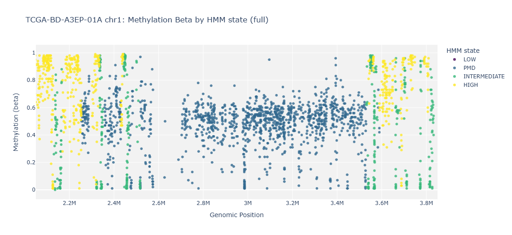

# MethylSeg

MethylSeg is a Python toolkit for identifying methylation domains from
whole-genome bisulfite sequencing (WGBS) and microarray methylation data. It
supports data preparation, methylation-state model training, genome
segmentation, region cleaning, and visualization.

This README introduces the standard workflow. For the complete API reference
and example notebooks, see the [MethylSeg documentation](https://clementlab.github.io/MethylSeg/).

> [!IMPORTANT]
> Microarray support has currently been tested with Illumina HumanMethylation450 BeadChip (HM450K) data. Other methylation microarrays, such as Illumina HumanMethylation27 and MethylationEPIC, can be used, but array-specific defaults are not yet available and these platforms have not been formally tested.

## Hardware requirements

Memory usage depends on the input data type and dataset size. The following
values were observed during testing:

| Data type | Typical memory usage | Recommended system memory |
| --- | ---: | ---: |
| WGBS | ~12 GB average; up to ~15 GB peak | ≥16 GB |
| HM450K | <1 GB | ≥8 GB |

> [!NOTE]
> Numba has known compatibility issues on ARM-based systems. See the
> [Troubleshooting guide](TROUBLESHOOTING.md) for installation guidance.

## Installation

Install the current package from GitHub:

```bash
python -m pip install "git+https://github.com/clementlab/MethylSeg.git"
```

or from TestPyPI

```bash
python -m pip install \
  --index-url https://test.pypi.org/simple/ \
  --extra-index-url https://pypi.org/simple/ \
  methylseg
```

The repository also includes `environment.yml` for conda-based local setup.

## Reference files

### Sample data

Three reference samples are available for use in tutorials and testing.

```bash
methylseg download_data_files
```

The two colon cancer samples were originally generated by Hansen et al. (2011) and were obtained from the data distributed with MethyLasso (Balaramane et al., 2024).

The liver cancer sample, `TCGA-BD-A3EP-01A`, was obtained from the [TCGA-LIHC project through the NCI Genomic Data Commons](https://portal.gdc.cancer.gov/cases/de302b98-250d-42fe-9945-11e1b2bbd3c6).

| Sample name | WGBS filename | HM450K filename |
| --- | --- | --- |
| `WGBS_colon-primary-tumor_1` | `WGBS_colon-primary-tumor_1_wgbs.tsv` | `WGBS_colon-primary-tumor_1_450k.beta` |
| `WGBS_colon-primary-tumor_2` | `WGBS_colon-primary-tumor_2_wgbs.tsv` | `WGBS_colon-primary-tumor_2_450k.beta` |
| `TCGA-BD-A3EP-01A` | N/A | `TCGA-BD-A3EP-01A_450k.tsv` |

#### References

1. Hansen, K. D., et al. Increased methylation variation in epigenetic domains across cancer types. *Nature Genetics* **43**, 768–775 (2011).
2. Balaramane, D., Spill, Y. G., Weber, M. & Bardet, A. F. MethyLasso: a segmentation approach to analyze DNA methylation patterns and identify differentially methylated regions from whole-genome datasets. *Nucleic Acids Research* **52**, e98 (2024).

### Pretrained models

Two pretrained models are provided for tutorials, testing, and exploratory
analysis:

| Model filename | Training data |
| --- | --- |
| `wgbs_colon_model` | `WGBS_colon-primary-tumor_1_wgbs.tsv` |
| `tcga_hm450k_model` | `TCGA-BD-A3EP-01A` |

Load a pretrained model with `get_pretrained_model`:

```python
# WGBS model
wgbs_saved = MethylSegPathway.get_pretrained_model(
    out_dir=OUTPUT_DIR,
    resolution="wgbs",
)

# HM450K model
hm450k_saved = MethylSegPathway.get_pretrained_model(
    out_dir=OUTPUT_DIR,
    resolution="450k",
)
```

## Quick start

The default workflow trains a model on your input, segments one chromosome,
cleans the calls, and draws a cleaned PMD overlay. Use `resolution="wgbs"` for WGBS count tables or `resolution="450k"` for HM450K
beta-value tables. Other microarray platforms may require manually configured
parameters until array-specific defaults are added.

```python
from pathlib import Path

from methylseg import MethylSegPathway, MethylationStates
from methylseg.helper_classes import DATA_DIR

reference_dir = DATA_DIR / "reference_files"

# WGBS: replace these with your own sample name and count table.
# sample_name = "WGBS_colon-primary-tumor_1"
# sample_file = reference_dir / "WGBS_colon-primary-tumor_1_wgbs.tsv.gz"
# resolution = "wgbs"

TCGA/HM450K alternative:
sample_name = "TCGA-BD-A3EP-01A"
sample_file = reference_dir / "TCGA-BD-A3EP-01A_450k.tsv.gz"
resolution = "450k"

sample_info, removed_df = MethylSegPathway.prepare_sample_info(
    sample_name=sample_name,
    sample_file=sample_file,
    resolution=resolution,
    min_coverage=10,
)

pathway = MethylSegPathway(
    train_sample_info=sample_info,
    out_dir=Path("out/quickstart") / sample_name,
)

pathway.fit_pathway()

regions = pathway.generate_regions(sample_info=sample_info, chrom="chr1")

fig = pathway.plot_labels(
    sample_info=sample_info,
    sample_info_removed=removed_df,
    chrom="chr1",
    region_chrom="chr1",
    region_start=2_200_000,
    region_end=3_700_000
)
```



`run_pathway(sample_info=sample_info, chroms=["chr1"])` performs fitting,
segmentation, cleaning, and summary-file writing in one call.

See
[run_full_pipeline.ipynb](examples/run_full_pipeline.ipynb) for the full end-to-end workflow.

## Input formats

MethylSeg accepts tab-delimited `.tsv` and `.tsv.gz` files. Genomic coordinates
must use 0-based, half-open
coordinates, and chromosome names must be consistent throughout the input.

WGBS input supplies methylated-read counts and total coverage; beta values are
calculated internally.

| CpG_chrm | CpG_beg | CpG_end | meth | coverage |
| --- | --- | --- | --- | --- |
| chr1 | 10468 | 10470 | 14 | 15 |
| chr1 | 10470 | 10472 | 10 | 10 |
| chr1 | 10483 | 10485 | 23 | 28 |

TCGA/HM450K input supplies beta values directly. The optional `probe` column is
kept as metadata.

| CpG_chrm | CpG_beg | CpG_end | beta | probe |
| --- | --- | --- | --- | --- |
| chr1 | 15864 | 15866 | 0.0 | cg13869341 |
| chr1 | 29406 | 29408 | 0.0 | cg12045430 |
| chr1 | 29424 | 29426 | 0.0 | cg20826792 |

The full inputs used below are installed at `data/reference_files/` by
`methylseg download_data_files`.

## Outputs

The final output of MethylSeg consists primarily of BED files containing the
identified methylation domains. Separate files are generated for each
methylation state: `HIGH`, `INTERMEDIATE`, `LOW`, and `PMD`.

For each chromosome and state, MethylSeg writes:

| Output | Filename pattern | Description |
| --- | --- | --- |
| Raw regions | `segments_{chrom}_{sample_id}_{resolution}_{state}.bed` | Regions produced directly by genome segmentation |
| Cleaned regions | `clean_regions/segments_cleaned_{chrom}_{sample_id}_{resolution}_{state}.bed` | Regions retained after merging and filtering |
| Cleaned metadata | `clean_regions/metadata_cleaned_{chrom}_{sample_id}_{resolution}_{state}.tsv` | Additional information about the cleaned regions |

After all requested chromosomes have been processed, MethylSeg also creates
genome-wide files for each state under `summary_files/`:

| Output | Filename pattern |
| --- | --- |
| Genome-wide raw regions | `segments_raw_{state}.bed` |
| Genome-wide cleaned regions | `segments_cleaned_{state}.bed` |
| Genome-wide cleaned metadata | `metadata_cleaned_{state}.tsv` |

A simplified output directory has the following structure:

```text
methylseg_output/
├── segments_chr1_sample.wgbs_PMD.bed
├── segments_chr1_sample.wgbs_LOW.bed
├── clean_regions/
│   ├── segments_cleaned_chr1_sample.wgbs_PMD.bed
│   ├── segments_cleaned_chr1_sample.wgbs_LOW.bed
│   ├── metadata_cleaned_chr1_sample.wgbs_PMD.tsv
│   └── metadata_cleaned_chr1_sample.wgbs_LOW.tsv
└── summary_files/
    ├── segments_raw_PMD.bed
    ├── segments_raw_LOW.bed
    ├── segments_cleaned_PMD.bed
    ├── segments_cleaned_LOW.bed
    ├── metadata_cleaned_PMD.tsv
    └── metadata_cleaned_LOW.tsv
```

Each BED file contains 0-based, half-open genomic coordinates and the assigned
methylation state. For example, segments_cleaned_PMD.bed may contain:

| Chromosome |     Start |       End | State |
| ---------- | --------: | --------: | ----- |
| `chr1`     | 1,261,344 | 1,323,691 | `PMD` |
| `chr1`     | 2,789,167 | 2,999,312 | `PMD` |
| `chr1`     | 3,885,138 | 3,916,529 | `PMD` |
| `chr1`     | 6,167,866 | 6,186,177 | `PMD` |

The BED files themselves are tab-delimited and do not contain a header.

## Citation

A manuscript describing MethylSeg is in preparation. Citation information will
be added when it becomes available.

## Planned support

- [ ] Add defaults for HM27 and EPIC microarray formats

## Reporting issues

To report a bug, request a feature, or ask a question about MethylSeg, open an
issue on the [GitHub issue tracker](https://github.com/clementlab/MethylSeg/issues).

When reporting a bug, please include:

- Your MethylSeg version
- Your Python version and operating system
- The complete error message or traceback
- A minimal example that reproduces the problem, when possible

## License

MethylSeg is distributed under the [BSD 3-Clause License](LICENSE.md).
